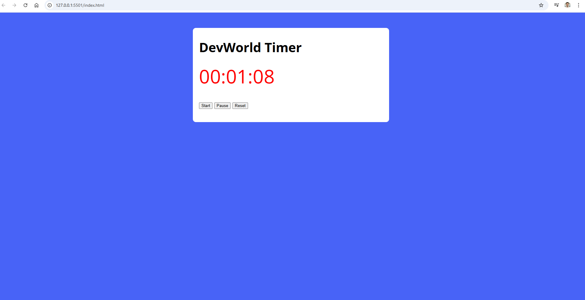

DevWorld Timer ⏱️

  

A minimal, fast, vanilla JS timer with Start, Pause, and Reset. Clean UI, zero dependencies, and readable code.

   &nbsp;  

✨ Features

HH:MM:SS display with 1s tick

Start / Pause / Reset controls

Event delegation (um único listener para todos os botões)

State styling: quando pausado, o tempo fica vermelho (.paused)

CSS custom properties para personalizar cores

🧱 Tech Stack

HTML5 (estrutura semântica simples)

JavaScript (vanilla) — sem frameworks ou build steps

📁 Project Structure
.
├── index.html
├── style.css
├── script.js
└── assets/
    └── preview.png     

🧭 How it works (high-level)

State: um contador seconds é incrementado a cada 1s por setInterval.

Format: getTimeFromSeconds(seconds) usa Date + toLocaleTimeString("pt-br", { timeZone: "UTC", hour12: false }) para exibir HH:MM:SS.

Controls: clique em Start inicia (ou reinicia) o intervalo; Pause interrompe; Reset zera o relógio e o estado visual.

Event Delegation: um único document.addEventListener('click', ...) decide a ação com classList.contains(...).

Key snippet — event delegation:

document.addEventListener('click', (e) => {
  const el = e.target;

  if (el.classList.contains('reset')) {
    clearInterval(timer);
    components.clock.classList.remove('paused');
    components.clock.innerHTML = '00:00:00';
    seconds = 0;
  }

  if (el.classList.contains('start')) {
    components.clock.classList.remove('paused');
    clearInterval(timer);
    startClock();
  }

  if (el.classList.contains('pause')) {
    components.clock.classList.add('paused');
    clearInterval(timer);
  }
});

🧩 Customization

Cores (no :root):

:root {
  --primary-color: #4863f7;
  --primary-color-darker: #2f41a5;
}

Estado pausado:

.paused { color: red; }  /* mude para a cor que preferir */

